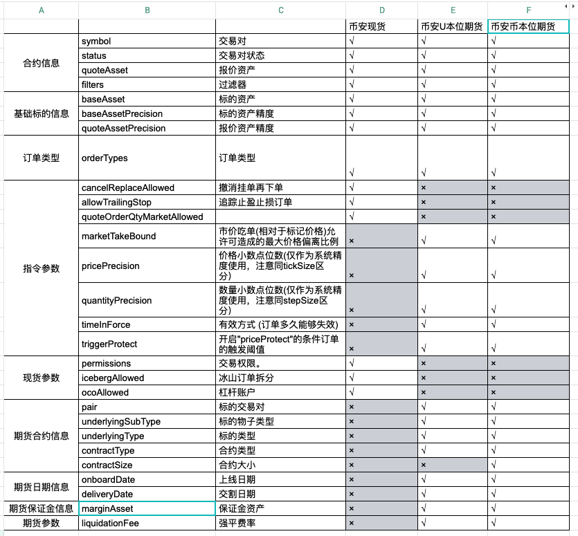

# 交易参数

现货交易的数字货币市场交易规则的具体交易参数，基于币对不同，对最小下单数量/最小价格波动/最小下单总金额及市单价单笔最大数量都有相应的参数指标，具体详情请参考：[币安交易规则  ](https://www.binance.com/cn/trade-rule)

如:

* BNB市场：基于BNB的币对交易市场
* BTC市场：基于BTC的币对交易市场
* ALTS市场：ALTS即Alt Coins，这里指各类其它交易对市场
* FIAT市场：FIAT是法币的意思，FIAT市场是指基于法定货币（国家发行的货币）或锚定法定货币的交易对交易市场，如USDT/BUSD等。

## 交易参数格式

